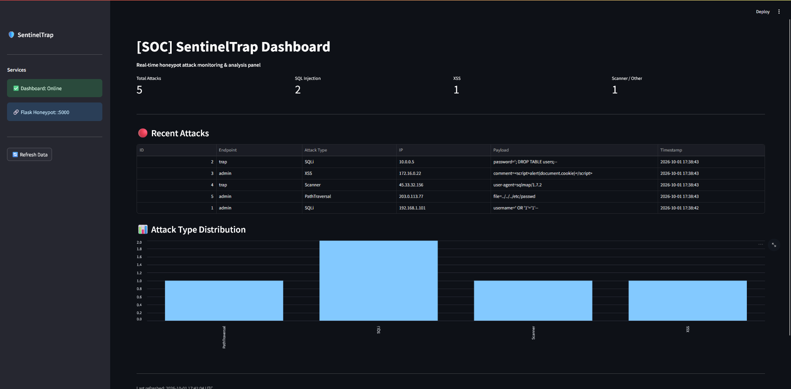

# SentinelTrap-Web 🛡️


> **A professional Web Honeypot & Cyber Security Analysis Panel** — Built for CV-level portfolio demonstration.

---

## 📸 Dashboard Preview



---

## 🎯 Purpose & Threat Model

SentinelTrap-Web is a **research-grade honeypot** designed to:

- **Lure** attackers into fake administrative endpoints
- **Detect** malicious payloads (SQLi, XSS, Path Traversal, Scanner fingerprints)
- **Log** all attack data (IP, payload, timestamp, attack type) in an isolated SQLite database
- **Visualize** threats in real-time through a Streamlit SOC panel

**Threat Model:** External actors attempting credential brute-force, injection attacks, or automated scanning against web login endpoints.

---

## 🏗️ Architecture

```
Internet (Attacker)
        │
        ▼
┌─────────────────────────┐
│   Flask Honeypot :5000  │
│  /admin/login (401)     │
│  /trap/login  (200 lure)│
└────────────┬────────────┘
             │
             ▼
┌─────────────────────────┐
│   Detection Engine      │
│   (SQLi / XSS /         │
│    Path Traversal /      │
│    Scanner Regex)        │
└────────────┬────────────┘
             │
             ▼
┌─────────────────────────┐
│   SQLite Database       │
│   attacks.db            │
└────────────┬────────────┘
             │
             ▼
┌─────────────────────────┐
│ Streamlit SOC Dashboard │
│   127.0.0.1:8501        │
│   Metrics / Table /     │
│   Bar Chart             │
└─────────────────────────┘
```

---

## ⚡ Quick Start

### Prerequisites
- Python 3.12+
- Windows (or WSL for Linux-style commands)

### 1. Clone the repository
```bash
git clone https://github.com/AhmetCol11/sentineltrap-web.git
cd sentineltrap-web
```

### 2. Configure environment variables
```bash
# Copy the example env file
cp .env.example .env

# Edit .env with your values
# SECRET_KEY=your-secret-here
```

### 3. Create virtual environment & install dependencies
```bash
python -m venv venv
.\venv\Scripts\pip.exe install -r requirements.txt
```

### 4. Launch all services (Windows — one click)
```bat
baslat.bat
```

This will:
1. Start the **Flask honeypot** in a dedicated terminal window (`localhost:5000`)
2. Start the **Streamlit dashboard** in a dedicated terminal window (`localhost:8501`)
3. Open the dashboard automatically in your default browser

---

## 🔍 Detected Attack Types

| Attack Type | Example Payload | Detection Method |
|-------------|----------------|-----------------|
| **SQL Injection** | `' OR '1'='1'--` | Regex: `OR`, `UNION`, `SELECT`, `DROP`, quotes |
| **XSS** | `<script>alert(document.cookie)</script>` | Regex: `<script>`, `onerror=`, `javascript:` |
| **Path Traversal** | `../../../etc/passwd` | Regex: `../`, `etc/passwd`, `cmd.exe` |
| **Scanner / Recon** | `User-Agent: sqlmap/1.7` | Regex: `sqlmap`, `nikto`, `nmap`, `masscan` |

---

## 🔐 Security & Environment

All sensitive configuration is managed via environment variables — **zero hardcoded secrets**:

```bash
# .env (never commit this file)
SECRET_KEY=your-secret-key
FLASK_PORT=5000
STREAMLIT_PORT=8501
DB_PATH=app/attacks.db
```

See [`.env.example`](.env.example) for the full template.  
See [`docs/security-review.md`](docs/security-review.md) for the full enterprise security audit.

---

## 📁 Project Structure

```
sentineltrap-web/
├── app/
│   ├── __init__.py
│   ├── server.py      # Flask honeypot endpoints
│   ├── detector.py    # SQLi / XSS / Scanner detection engine
│   └── database.py    # SQLite logging layer
├── dashboard/
│   └── app.py         # Streamlit SOC dashboard
├── docs/
│   └── security-review.md  # Enterprise security audit
├── .env.example       # Environment config template
├── baslat.bat         # One-click Windows launcher
├── Dockerfile
├── docker-compose.yml
└── requirements.txt
```

---

## ⚠️ Security & Ethics Disclaimer

> This project is intended **exclusively for authorized security research, educational purposes, and portfolio demonstration**.
>
> - Do **NOT** deploy this honeypot against systems you do not own or have explicit written permission to test.
> - Do **NOT** use collected attack data for any purpose beyond local research and analysis.
> - The maintainer assumes **no liability** for misuse of this software.
>
> Honeypot operation may be subject to local laws. Ensure compliance with applicable regulations before deployment.

---

## 📄 License

MIT — See [LICENSE](LICENSE) for details.
